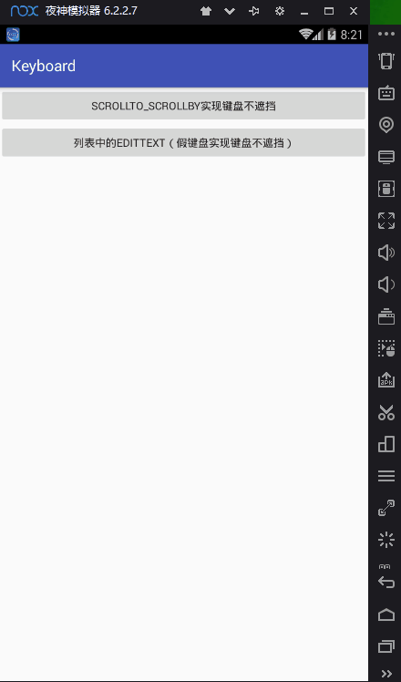

  微信公众号
 

[简书](https://www.jianshu.com/p/472b1bbc0b94)

[APK](https://github.com/AnJiaoDe/Keyboard/blob/master/app/build/outputs/apk/app-debug.apk)


**使用方法**

将libray模块复制到项目中,或者直接在build.gradle中依赖:

```
allprojects {
		repositories {
			
			maven { url 'https://jitpack.io' }
		}
	}
```

```
dependencies {
	        compile 'com.github.AnJiaoDe:Keyboard:V1.0.0'
	}
```

**注意：如果sync报错，是因为和com.android.tools.build:gradle 3.0有关，**
**可以改将compile改为implementation 或者api** 

**1.scrollTo、scrollBy实现键盘不遮挡**
------------------------------



 使用方法：
 

```
<LinearLayout xmlns:android="http://schemas.android.com/apk/res/android"
    xmlns:tools="http://schemas.android.com/tools"
    android:layout_width="match_parent"
    android:layout_height="match_parent"
    android:orientation="vertical">


    <RelativeLayout
        android:layout_width="match_parent"

        android:layout_height="44dp"
        android:background="@color/colorPrimary">


        <TextView
            android:layout_width="match_parent"
            android:layout_height="match_parent"
            android:gravity="center"
            android:text="提现"
            android:textColor="#ffffff" />
    </RelativeLayout>


    <LinearLayout
        android:id="@+id/layout_content"
        android:layout_width="match_parent"
        android:layout_height="match_parent"
        android:background="#E9F4FB"
        android:orientation="vertical">


        <LinearLayout
            android:layout_width="match_parent"
            android:layout_height="38dp"
            android:layout_marginLeft="15dp"
            android:layout_marginRight="15dp"

            android:gravity="center_vertical"
            android:orientation="horizontal">

            <View
                android:layout_width="0dp"
                android:layout_height="match_parent"
                android:layout_weight="1" />

        </LinearLayout>


        <LinearLayout
            android:layout_width="match_parent"
            android:layout_height="0dp"
            android:layout_weight="1"
            android:orientation="vertical">

            <LinearLayout
                android:layout_width="match_parent"
                android:layout_height="wrap_content"
                android:layout_marginLeft="15dp"
                android:orientation="horizontal">

                <TextView
                    android:layout_width="wrap_content"
                    android:layout_height="wrap_content"
                    android:text="可提余额："
                    android:textColor="#333333"
                    android:textSize="15sp" />

                <TextView
                    android:id="@+id/tv_yue"
                    android:layout_width="wrap_content"
                    android:layout_height="wrap_content"
                    android:text="2000.00"
                    android:textColor="#666666"
                    android:textSize="14sp" />

                <TextView
                    android:layout_width="wrap_content"
                    android:layout_height="wrap_content"
                    android:text="元"
                    android:textColor="#333333"
                    android:textSize="14sp" />
            </LinearLayout>

            <LinearLayout
                android:layout_width="match_parent"
                android:layout_height="wrap_content"
                android:layout_marginLeft="15dp"
                android:layout_marginTop="20dp"
                android:orientation="horizontal">

                <TextView
                    android:layout_width="wrap_content"
                    android:layout_height="wrap_content"
                    android:text="手续费(0.6%):"
                    android:textColor="#333333"
                    android:textSize="15sp" />

                <TextView
                    android:id="@+id/tv_shouxufei"
                    android:layout_width="wrap_content"
                    android:layout_height="wrap_content"
                    android:text="0.00"
                    android:textColor="#666666"
                    android:textSize="14sp" />

                <TextView
                    android:layout_width="wrap_content"
                    android:layout_height="wrap_content"
                    android:text="元"
                    android:textColor="#333333"
                    android:textSize="14sp" />
            </LinearLayout>


            <LinearLayout
                android:layout_width="wrap_content"
                android:layout_height="wrap_content"
                android:layout_marginLeft="15dp"
                android:layout_marginTop="20dp"
                android:gravity="center_vertical"
                android:orientation="horizontal">

                <TextView
                    android:layout_width="wrap_content"
                    android:layout_height="wrap_content"
                    android:text="提现方式:"
                    android:textColor="#333333"
                    android:textSize="15sp" />


                <TextView
                    android:layout_width="wrap_content"
                    android:layout_height="wrap_content"
                    android:layout_marginLeft="3dp"
                    android:text="支付宝"
                    android:textColor="#666666"
                    android:textSize="14sp" />


                <TextView
                    android:layout_width="wrap_content"
                    android:layout_height="wrap_content"
                    android:layout_marginLeft="3dp"
                    android:text="银行卡"
                    android:textColor="#666666"
                    android:textSize="14sp" />
            </LinearLayout>

            <View
                android:layout_width="match_parent"
                android:layout_height="1dp"
                android:layout_marginTop="20dp"


                android:background="@color/line" />

            <TextView
                android:layout_width="match_parent"
                android:layout_height="wrap_content"
                android:layout_marginTop="11dp"
                android:gravity="center"
                android:text="申请提现金额"
                android:textColor="#333333"
                android:textSize="15sp" />


            <LinearLayout
                android:id="@+id/layout_et"
                android:layout_width="match_parent"
                android:layout_height="wrap_content"
                android:layout_marginLeft="23dp"
                android:layout_marginRight="23dp"
                android:layout_marginTop="13dp"
                android:orientation="vertical">

                <View
                    android:layout_width="match_parent"
                    android:layout_height="0dp"
                    android:layout_weight="1"/>
                <EditText
                    android:id="@+id/et_jine"
                    android:layout_width="match_parent"
                    android:layout_height="wrap_content"
                    android:layout_marginTop="30dp"
                    android:background="@null"
                    android:gravity="center"
                    android:hint="请输入提现金额"
                    android:inputType="numberDecimal|number"
                    android:maxLength="20"
                    android:minHeight="44dp"
                    android:textColorHint="#999999"
                    android:textSize="14sp" />

                <View
                    android:layout_width="match_parent"
                    android:layout_height="1dp"
                    android:layout_marginTop="30dp"
                    android:background="#A7ABB1" />

            </LinearLayout>


            <Button
                android:id="@+id/tv_submit"
                android:layout_width="match_parent"
                android:layout_height="49dp"
                android:layout_marginLeft="38dp"
                android:layout_marginRight="38dp"
                android:layout_marginTop="33dp"
                android:gravity="center"
                android:text="确定"
                android:textColor="@color/white"
                android:textSize="16sp" />
        </LinearLayout>


    </LinearLayout>

</LinearLayout>

```

```
public class EditTextActivity extends KeyboardActivity {
    private View layout_content;
    @Override
    protected void onCreate(Bundle savedInstanceState) {
        super.onCreate(savedInstanceState);
        setContentView(R.layout.activity_edit_text);

        layout_content=findViewById(R.id.layout_content);
        //设置监听器
        setOnCYGlobalLayoutListener(new OnCYGlobalLayoutListener() {
            //键盘刚显示
            @Override
            public void onKeyboardShowedNow(Rect rect) {
                //rect 可视区域
                //screenHight-rect.bottom就是键盘高度
                layout_content.scrollTo(0,screenHight-rect.bottom);

            }
            //键盘刚隐藏,可以对输入的内容进行修改


            @Override
            public void onKeyboardHideNow() {
                layout_content.scrollTo(0,0);


            }
        });
    }
}
```

**2.列表中的Edittext,利用假键盘实现键盘不遮挡**
-------------------------------


 
 使用方法：

```
<?xml version="1.0" encoding="utf-8"?>
<LinearLayout xmlns:android="http://schemas.android.com/apk/res/android"
    xmlns:tools="http://schemas.android.com/tools"
    android:id="@+id/activity_modify_price2"
    android:layout_width="match_parent"
    android:layout_height="match_parent"
    android:orientation="vertical">


    <RelativeLayout
        android:background="@color/colorPrimary"

        android:layout_width="match_parent"
        android:layout_height="44dp">


        <TextView
            android:layout_width="match_parent"
            android:gravity="center"
            android:layout_height="match_parent"
            android:text="修改价格"
            android:textColor="#ffffff" />
    </RelativeLayout>


    <com.cy.cyrvadapter.recyclerview.VerticalRecyclerView
        android:id="@+id/vrv"
        android:layout_width="match_parent"
        android:layout_height="0dp"
        android:layout_weight="1" />

    <View
        android:id="@+id/view_keyboard"
        android:layout_width="match_parent"
        android:layout_height="0dp" />


</LinearLayout>

```

```
public class RVEdittextActivity extends KeyboardMockActivity {
    private RVAdapter<String> rvAdapter;

    private View view_keybord;

    @Override
    protected void onCreate(Bundle savedInstanceState) {
        super.onCreate(savedInstanceState);
        setContentView(R.layout.activity_rvedittext);

        List<String> list = new ArrayList<>();
        list.add("dojij");
        list.add("dojij");
        list.add("dojij");
        list.add("dojij");
        list.add("dojij");
        list.add("dojij");
        list.add("dojij");
        list.add("dojij");
        list.add("dojij");
        list.add("dojij");
        list.add("dojij");
        list.add("dojij");
        list.add("dojij");
        list.add("dojij");
        list.add("dojij");
        list.add("dojij");
        list.add("dojij");
        list.add("dojij");
        list.add("dojij");
        list.add("dojij");
        list.add("dojij");
        list.add("dojij");
        list.add("dojij");
        list.add("dojij");
        list.add("dojij");
        rvAdapter = new RVAdapter<String>(list) {
            @Override
            public void bindDataToView(RVViewHolder holder, int position, String bean, boolean isSelected) {

            }

            @Override
            public int getItemLayoutID(int position, String bean) {
                return R.layout.item_price_modify;
            }

            @Override
            public void onItemClick(int position, String bean) {

            }
        };
        //万能适配器：https://github.com/AnJiaoDe/RecyclerViewAdapter
        ((VerticalRecyclerView) findViewById(R.id.vrv)).setAdapter(rvAdapter);
        //设置监听器
        setOnCYGlobalLayoutListener(view_keybord, new OnCYGlobalLayoutListener() {
            //键盘刚显示
            @Override
            public void onKeyboardShowedNow(Rect rect) {

            }

            //键盘刚隐藏,可以对输入的内容进行修改
            @Override
            public void onKeyboardHideNow() {


            }

            //假键盘高度
            @Override
            public int getViewKeyboardHeight(Rect rect) {
                return screenHight-rect.bottom;//screenHight-rect.bottom就是键盘高度
            }
        });
    }
}

```

 
 源码：

```
/**
 * Created by cy on 2018/9/6.,用在普通界面中的edittext
 */

public abstract class KeyboardActivity extends AppCompatActivity implements ViewTreeObserver.OnGlobalLayoutListener {


    public int screenHight = 0;
    private OnCYGlobalLayoutListener onCYGlobalLayoutListener;

    @Override
    protected void onCreate(@Nullable Bundle savedInstanceState) {
        super.onCreate(savedInstanceState);
        screenHight = ScreenUtils.getScreenHeight(getApplicationContext());
    }

    @Override
    protected void onResume() {
        super.onResume();
        addGlobal();
    }

    @Override
    protected void onStop() {
        super.onStop();
        removeGlobal();
    }

    private void addGlobal() {
        if (onCYGlobalLayoutListener!=null)
        getWindow().getDecorView().getViewTreeObserver().addOnGlobalLayoutListener(this);

    }

    private void removeGlobal() {
        getWindow().getDecorView().getViewTreeObserver().removeOnGlobalLayoutListener(this);

    }

    @Override
    public void onGlobalLayout() {

//        CYLogUtils.log("布局变化", "---------------------------------------");
        Rect r = new Rect();
        //获取当前界面可视部分
        getWindow().getDecorView().getWindowVisibleDisplayFrame(r);
        //如果屏幕高度和Window可见区域高度差值大于整个屏幕高度的1/3，则表示软键盘显示中，否则软键盘为隐藏状态。
//        int heightDifference = screenHeight - (r.bottom - r.top);
        boolean isKeyboardShowing = r.bottom < ScreenUtils.getScreenHeight(getApplicationContext());

        if (isKeyboardShowing) {
//            Toast.makeText(this, "键盘显示", Toast.LENGTH_SHORT).show();
            removeGlobal();

            onCYGlobalLayoutListener.onKeyboardShowedNow(r);
            //会导致布局不断刷新，无限制回调当前方法,所以做延迟回调处理

            new Handler().postDelayed(new Runnable() {
                @Override
                public void run() {
                    addGlobal();
                }
            }, 100);
        } else {
//            Toast.makeText(this, "键盘隐藏", Toast.LENGTH_SHORT).show();

            removeGlobal();
            onCYGlobalLayoutListener.onKeyboardHideNow();

            //会导致布局不断刷新，无限制回调当前方法,所以做延迟回调处理

            new Handler().postDelayed(new Runnable() {
                @Override
                public void run() {
                    addGlobal();
                }
            }, 100);


        }

    }

    public int getScreenHight() {
        return screenHight;
    }

    /**
     * @param onCYGlobalLayoutListener
     */
    public void setOnCYGlobalLayoutListener( OnCYGlobalLayoutListener onCYGlobalLayoutListener) {
        this.onCYGlobalLayoutListener = onCYGlobalLayoutListener;

        addGlobal();
    }

    public interface OnCYGlobalLayoutListener {
        public void onKeyboardShowedNow(Rect rect);//键盘刚显示

        public void onKeyboardHideNow();//键盘刚隐藏

    }
}

```

 

```
/**
 * Created by cy on 2018/9/6.,假键盘，用在列表中的edittext
 */

public abstract class KeyboardMockActivity extends AppCompatActivity implements ViewTreeObserver.OnGlobalLayoutListener {

    private View view_keyboard;

    public int screenHight = 0;
    private OnCYGlobalLayoutListener onCYGlobalLayoutListener;

    @Override
    protected void onCreate(@Nullable Bundle savedInstanceState) {
        super.onCreate(savedInstanceState);
        screenHight = ScreenUtils.getScreenHeight(getApplicationContext());
    }

    @Override
    protected void onResume() {
        super.onResume();
        addGlobal();
    }

    @Override
    protected void onStop() {
        super.onStop();
        removeGlobal();
    }

    private void addGlobal() {
        if (view_keyboard == null) return;
        getWindow().getDecorView().getViewTreeObserver().addOnGlobalLayoutListener(this);

    }

    private void removeGlobal() {
        getWindow().getDecorView().getViewTreeObserver().removeOnGlobalLayoutListener(this);

    }

    @Override
    public void onGlobalLayout() {

        if (view_keyboard == null) {
            removeGlobal();
            return;
        }
//        CYLogUtils.log("布局变化", "---------------------------------------");
        Rect r = new Rect();
        //获取当前界面可视部分
        getWindow().getDecorView().getWindowVisibleDisplayFrame(r);
        //如果屏幕高度和Window可见区域高度差值大于整个屏幕高度的1/3，则表示软键盘显示中，否则软键盘为隐藏状态。
//        int heightDifference = screenHeight - (r.bottom - r.top);
        boolean isKeyboardShowing = r.bottom < ScreenUtils.getScreenHeight(getApplicationContext());

        if (isKeyboardShowing) {
            if (view_keyboard.getVisibility() == View.VISIBLE) return;
//            Toast.makeText(this, "键盘显示", Toast.LENGTH_SHORT).show();
            removeGlobal();


            LinearLayout.LayoutParams layoutParams = (LinearLayout.LayoutParams) view_keyboard.getLayoutParams();

            layoutParams.height = onCYGlobalLayoutListener.getViewKeyboardHeight(r);

            view_keyboard.setVisibility(View.VISIBLE);


            onCYGlobalLayoutListener.onKeyboardShowedNow(r);

            //会导致布局不断刷新，无限制回调当前方法,所以做延迟回调处理

            new Handler().postDelayed(new Runnable() {
                @Override
                public void run() {
                    addGlobal();
                }
            }, 100);
        } else {
//            Toast.makeText(this, "键盘隐藏", Toast.LENGTH_SHORT).show();
            if (view_keyboard.getVisibility() == View.GONE) return;

            removeGlobal();
            view_keyboard.setVisibility(View.GONE);

            onCYGlobalLayoutListener.onKeyboardHideNow();
            //会导致布局不断刷新，无限制回调当前方法,所以做延迟回调处理

            new Handler().postDelayed(new Runnable() {
                @Override
                public void run() {
                    addGlobal();
                }
            }, 100);


        }

    }

    public int getScreenHight() {
        return screenHight;
    }

    /**
     * @param view_keyboard            假键盘布局，使用时必须自行设置其高度，以满足 需要
     * @param onCYGlobalLayoutListener
     */
    public void setOnCYGlobalLayoutListener(View view_keyboard, OnCYGlobalLayoutListener onCYGlobalLayoutListener) {
        this.view_keyboard = view_keyboard;
        this.onCYGlobalLayoutListener = onCYGlobalLayoutListener;

        addGlobal();
    }

    public interface OnCYGlobalLayoutListener {
        public void onKeyboardShowedNow(Rect rect);//键盘刚显示

        public void onKeyboardHideNow();//键盘刚隐藏

        public int getViewKeyboardHeight(Rect rect);//返回假键盘的高度,rect 可视区域
    }
}

```

 
[GitHub](https://github.com/AnJiaoDe)

关注专题[Android开发常用开源库](https://www.jianshu.com/c/3ff4b3951dc5)

  微信公众号
 

QQ群


**License**

 Copyright [AnJiaoDe] [name of copyright owner]

   Licensed under the Apache License, Version 2.0 (the "License");
   you may not use this file except in compliance with the License.
   You may obtain a copy of the License at

       http://www.apache.org/licenses/LICENSE-2.0

   Unless required by applicable law or agreed to in writing, software
   distributed under the License is distributed on an "AS IS" BASIS,
   WITHOUT WARRANTIES OR CONDITIONS OF ANY KIND, either express or implied.
   See the License for the specific language governing permissions and
   limitations under the License.
